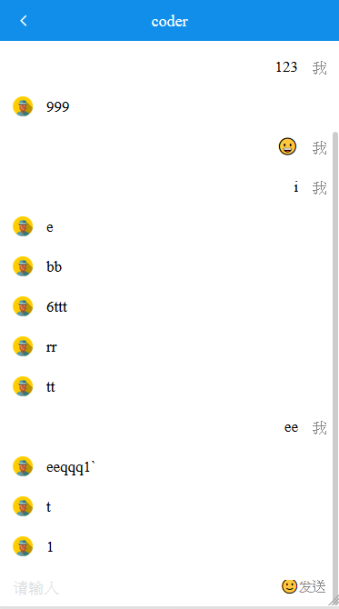

	A chat mobile web application, using react + react router + redux + axios + socketio + antd mobile  to build up, backend use express + mongodb 

In the project directory, you can run:

### `npm start`

Runs the app in the development mode. 
Open [http://localhost:3000](http://localhost:3000) to view it in the browser.

### backend
[https://github.com/wong2444/react_findJob_mobile_backend](https://github.com/wong2444/react_findJob_mobile_backend)

screen shot: 

